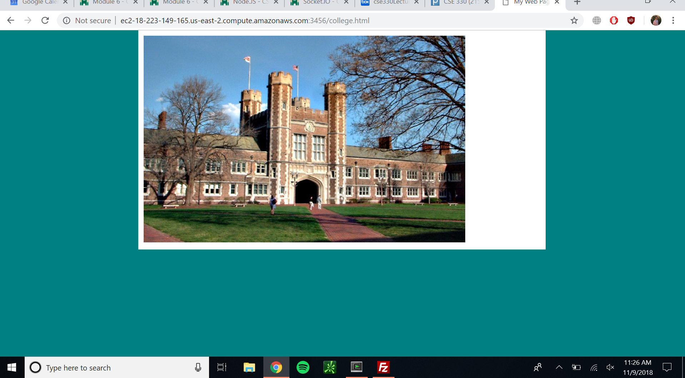

# Module 6
## Individual Portion
Peter Petev - 457577
## Individual Portion (25 Points):
* Node.JS is installed on my EC2 instance (5 points)
    * Screenshot of your browser visiting your EC2 instance serving up the college.html web page on port 3456, make sure the URL is visible in the screenshot.
    * 
* The hello.txt, brookings.jpg, and college.html files all load successfully (4 points each)
* Visiting a file that does not exist inside the static directory results in a 404 (4 points)
* Discuss in the README.md why phpinfo.php behaves the way it does when loaded through Node.JS (4 points)
    * **The phpinfo.php file does not display and instead downloads because there is no apache to serve it, so it does not get converted into html.**
* All of my individual portion files are pushed to Bitbucket (include your node.js file, hello.txt, brookings.jpg, college.html, and phpinfo.php)